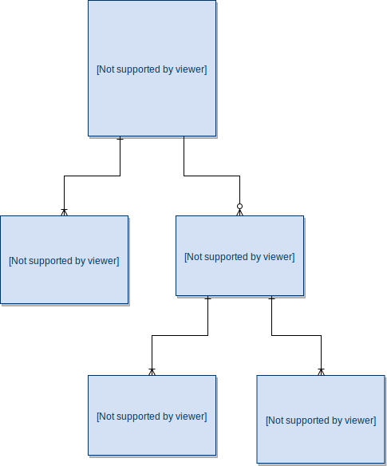

# Mockatron

## The amazing mock server!!!

Each mock at **Mockatron** is composed of an **Agent** with one or more **Responses**.

You can add one or more **Filters** to your **Agents** to route specific **Requests** to specific **Responses**, and you can define **Request Conditions** on **Requests** using the message body, headers, query params, and path params. **Response Conditions** can be applied to **Responses** filtering by a label, status code, and message body.

The image below illustrates the mock structure.

